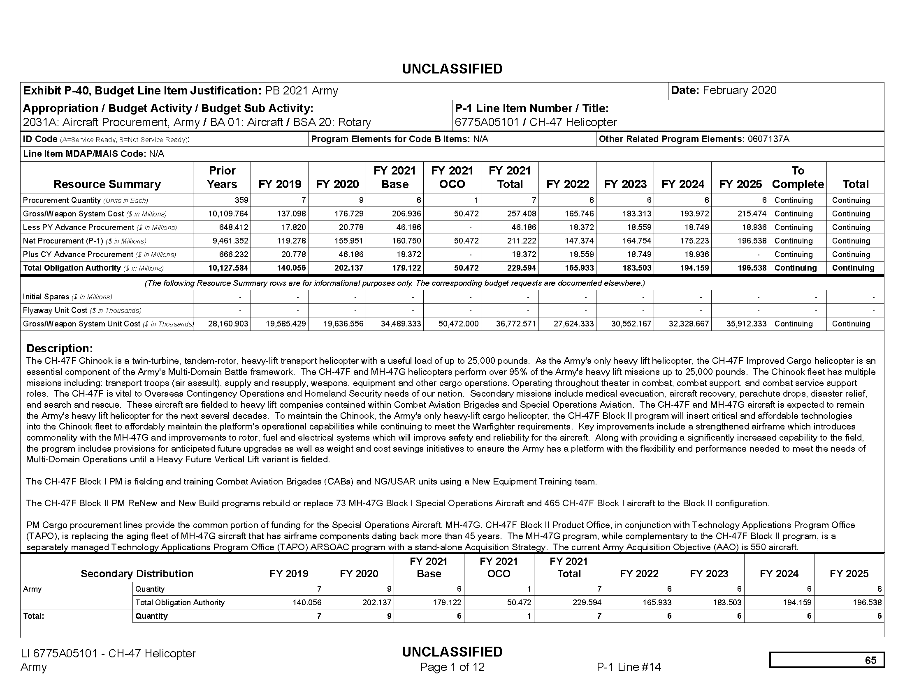
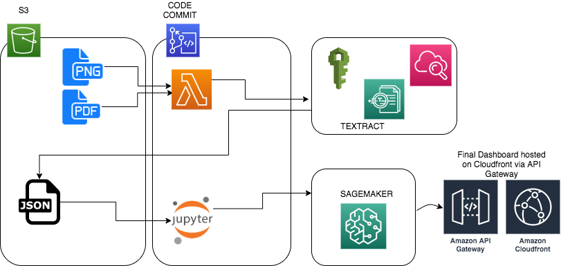

# Machine Learning Engineer Nanodegree
## Capstone Proposal
Austin Lasseter  
October 27, 2020

## Proposal

### Domain Background

The US Army must submit the President's Budget to Congress on the first Monday in February each year. The program in the Budget must be both "authorized" and "appropriated" before any dollars can be obligated. The Budget is accompanied by Justification Books, known as "J-Books", which are the documents an agency submits to the appropriations committees in support of its budget request. The Office of Management and Budget (OMB) prescribes justification materials, which typically explain changes between the current appropriation and the amounts requested for the next fiscal year.

While the J-Books are informative and publicly available, they are not designed for easy analysis. Text and numeric data are presented in PDF format, making it difficult to summarize by topic, or drill down into particular data trends. Following a tradition going back decades, the J-Books were designed to be printed and distributed in book format. While technology has evolved, the presentation of the J-Books has not. They are available in PDF format through the website of the US Army Office of Financial Management and Comptroller: https://www.asafm.army.mil/Budget-Materials/

The key term in the J-Books is "Total Obligational Authority," which represents the total amount of dollars budgeted to a line-item. According to GAO, the terms are defined as follows: 

* Obligation: A definite commitment that creates a legal liability of the government for the payment of goods and services ordered or received, or a legal duty on the part of the United States that could mature into a legal liability by virtue of actions on the part of the other party beyond the control of the United States. Payment may be made immediately or in the future. An agency incurs an obligation, for example, when it places an order, signs a contract, awards a grant, purchases a service, or takes other actions that require the government to make payments to the public or from one government account to another.

* Obligational Authority: The sum of (1) budget authority enacted for a given fiscal year, (2) unobligated balances of amounts that have not expired brought forward from prior years, (3) amounts of offsetting collections to be credited and available to specific funds or accounts during that year, and (4) budget authority transferred from other funds or accounts. 

### Problem Statement

When data is locked up in PDFs and associated with text, this is a classic problem for Natural Language Processing (NLP) combined with text extraction methods. The project will extract numeric and text data from the J-books, organize them into a dataset, and then carry out topic modeling followed by some exploratory analysis and time-series analysis. The project will answer the following questions:

* What are the primary topic clusters in the US Army budget, as a whole and by funding strata?
* How have topic clusters changed over time?
* Choose a few key words (like "artificial intelligence", "cloud computing", or "anti-terrorism") and track how their funding levels have changed over time.

### Datasets and Inputs

The original dataset is a series of PDF documents from the website of the US Army Office of Financial Management and Comptroller: https://www.asafm.army.mil/Budget-Materials/

Each page of the PDF documents includes a table of appropriations, followed by a description of the line-item. The key element from the table is "Total Obligation Authority," which represents the total amount of dollars budgeted to a line-item, spread across multiple fiscal years. Below is an example of a budget item from the 2019 J-Books (a Chinook helicopter). 

Once the data has been extracted from the PDF's, it will be summarized in a pandas dataframe according to the following schema. 

| Line Item | Description | TOA Prior Years | FY 2019 | FY 2020 | FY 2021 | FY 2022 | FY 2023 | FY 2024 | FY 2025 |
| - | - | - | - | - | - | - | - | - | - |
| Text | Text | $$ | $$ | $$ | $$ | $$ | $$ | $$ | $$ | $$ |
| Text | Text | $$ | $$ | $$ | $$ | $$ | $$ | $$ | $$ | $$ |
| Text | Text | $$ | $$ | $$ | $$ | $$ | $$ | $$ | $$ | $$ |

### Solution Statement
_(approx. 1 paragraph)_

In this section, clearly describe a solution to the problem. The solution should be applicable to the project domain and appropriate for the dataset(s) or input(s) given. Additionally, describe the solution thoroughly such that it is clear that the solution is quantifiable (the solution can be expressed in mathematical or logical terms) , measurable (the solution can be measured by some metric and clearly observed), and replicable (the solution can be reproduced and occurs more than once).

### Benchmark Model
_(approximately 1-2 paragraphs)_

In this section, provide the details for a benchmark model or result that relates to the domain, problem statement, and intended solution. Ideally, the benchmark model or result contextualizes existing methods or known information in the domain and problem given, which could then be objectively compared to the solution. Describe how the benchmark model or result is measurable (can be measured by some metric and clearly observed) with thorough detail.

### Evaluation Metrics
_(approx. 1-2 paragraphs)_

In this section, propose at least one evaluation metric that can be used to quantify the performance of both the benchmark model and the solution model. The evaluation metric(s) you propose should be appropriate given the context of the data, the problem statement, and the intended solution. Describe how the evaluation metric(s) are derived and provide an example of their mathematical representations (if applicable). Complex evaluation metrics should be clearly defined and quantifiable (can be expressed in mathematical or logical terms).

### Project Design
_(approx. 1 page)_

In this final section, summarize a theoretical workflow for approaching a solution given the problem. Provide thorough discussion for what strategies you may consider employing, what analysis of the data might be required before being used, or which algorithms will be considered for your implementation. The workflow and discussion that you provide should align with the qualities of the previous sections. Additionally, you are encouraged to include small visualizations, pseudocode, or diagrams to aid in describing the project design, but it is not required. The discussion should clearly outline your intended workflow of the capstone project.

Steps in the process:
* Extract the data from the PDFs
* Organize the data into a pandas dataframe (with appropriate data cleaning)
* Split the data into strata by size of obligation
* Topic Modeling by strata
* Time-series analysis: Topics by year
* Time-series analysis: Trace a few key words by year

Notes:
* This is not labeled data

-----------

**Before submitting your proposal, ask yourself. . .**

- Does the proposal you have written follow a well-organized structure similar to that of the project template?
- Is each section (particularly **Solution Statement** and **Project Design**) written in a clear, concise and specific fashion? Are there any ambiguous terms or phrases that need clarification?
- Would the intended audience of your project be able to understand your proposal?
- Have you properly proofread your proposal to assure there are minimal grammatical and spelling mistakes?
- Are all the resources used for this project correctly cited and referenced?
