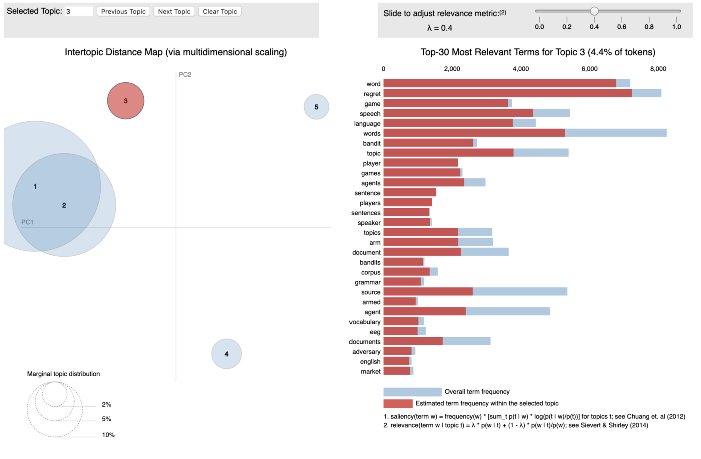

# Machine Learning Engineer Nanodegree
## Capstone Proposal
Austin Lasseter  
October 27, 2020

## Proposal

### Domain Background

The US Army must submit the President's Budget to Congress on the first Monday in February each year. The program in the Budget must be both "authorized" and "appropriated" before any dollars can be obligated. The Budget is accompanied by Justification Books, known as "J-Books", which are the documents an agency submits to the appropriations committees in support of its budget request. The Office of Management and Budget (OMB) prescribes justification materials, which typically explain changes between the current appropriation and the amounts requested for the next fiscal year.

While the J-Books are informative and publicly available, they are not designed for easy analysis. Text and numeric data are presented in PDF format, making it difficult to summarize by topic, or drill down into particular data trends. Following a tradition going back decades, the J-Books were designed to be printed and distributed in book format. While technology has evolved, the presentation of the J-Books has not. They are available in PDF format through the website of the US Army Office of Financial Management and Comptroller: https://www.asafm.army.mil/Budget-Materials/

The key term in the J-Books is "Total Obligational Authority," which represents the total amount of dollars budgeted to a line-item. According to GAO, the terms are defined as follows: 

* Obligation: A definite commitment that creates a legal liability of the government for the payment of goods and services ordered or received, or a legal duty on the part of the United States that could mature into a legal liability by virtue of actions on the part of the other party beyond the control of the United States. Payment may be made immediately or in the future. An agency incurs an obligation, for example, when it places an order, signs a contract, awards a grant, purchases a service, or takes other actions that require the government to make payments to the public or from one government account to another.

* Obligational Authority: The sum of (1) budget authority enacted for a given fiscal year, (2) unobligated balances of amounts that have not expired brought forward from prior years, (3) amounts of offsetting collections to be credited and available to specific funds or accounts during that year, and (4) budget authority transferred from other funds or accounts. 


### Problem Statement

When data is locked up in PDFs and associated with text, this is a classic problem for Natural Language Processing (NLP) combined with text extraction methods. The project will extract numeric and text data from the J-books, organize them into a dataset, and then carry out topic modeling followed by some exploratory analysis and time-series analysis. The project will answer the following questions:

* What are the primary topic clusters in the US Army budget, as a whole and by funding strata?
* How have topic clusters changed over time?
* Choose a few key words (like "artificial intelligence", "cloud computing", or "anti-terrorism") and track how their funding levels have changed over time.

### Datasets and Inputs

The original dataset is a series of PDF documents from the website of the US Army Office of Financial Management and Comptroller: https://www.asafm.army.mil/Budget-Materials/


Each page of the PDF documents includes a table of appropriations, followed by a description of the line-item. The key element from the table is "Total Obligation Authority," which represents the total amount of dollars budgeted to a line-item, spread across multiple fiscal years. Below is an example of a budget item from the 2019 J-Books (a Chinook helicopter). 


Once the data has been extracted from the PDF's, it will be summarized in a pandas dataframe according to the following schema. 

| Line Item | Description | TOA Prior Years | FY 2019 | FY 2020 | FY 2021 | FY 2022 | FY 2023 | FY 2024 | FY 2025 |
| - | - | - | - | - | - | - | - | - | - |
| Text | Text | $$ | $$ | $$ | $$ | $$ | $$ | $$ | $$ | $$ |
| Text | Text | $$ | $$ | $$ | $$ | $$ | $$ | $$ | $$ | $$ |
| Text | Text | $$ | $$ | $$ | $$ | $$ | $$ | $$ | $$ | $$ |


### Solution Statement

The final product of the analysis will be a dashboard displaying the results of the topic-modeling and time-series analyses in graphic format. The dashboard will include a bubble graphic that allows users to quickly summarize the topic clusters by fiscal strata, clearly displaying the top words associated with each cluster, as well as the size of the cluster. In addition, the dashboard will include line charts displaying the trends of topic clusters and individual terms, over time. In this way, users can grasp a more useful summary of the J-Book topics than what is available from the PDFs. In addition, the dataset of extracted text and fiscal information will be available for additional analysis.

Steps in the analytic process leading up to the solution:
* Extract the data from the PDFs
* Organize the data into a pandas dataframe (with appropriate data cleaning)
* Split the data into strata by size of obligation
* Modeling:
  * Topic Modeling by strata
  * Time-series analysis: Topics by year
  * Time-series analysis: Trace a few key words by year
* Visualize results in a dashboard

### Benchmark Model: Latent Dirichlet Allocation (LDA)

Topic modelling refers to the task of identifying topics that best describes a set of documents. These topics will only emerge during the topic modelling process (therefore called latent). And one popular topic modelling technique is known as Latent Dirichlet Allocation (LDA). LDA imagines a fixed set of topics. Each topic represents a set of words. The goal of LDA is to map all the documents to the topics in a such a way that the words in each document are mostly captured by those imaginary topics. 

LDA is based on word frequencies and topics distribution in texts. To put it simply, this method counts words in a given data set and groups them based on their co-occurrence into topics. Then the percentage distribution of topics in each document is calculated.

It's common to visualize the LDA topics for interpretability using a  popular visualization package, `pyLDAvis` which is designed to help interactively with:
* Better understanding and interpreting individual topics, and
* Better understanding the relationships between the topics.

Exploring the Intertopic Distance Plot using `pyLDAvis` can help the user learn about how topics relate to each other, including potential higher-level structure between groups of topics.



A benchmark model will include 10 topics. Evaluation metrics (described in the next section) will be used to determine the optimal number of topics, compared to the benchmark model.

### Evaluation Metrics

There are multiple ways to evaluate an LDA topic model, and there are also several metrics to choose from. 

* Topic Coherence scores a single topic by measuring the degree of semantic similarity between high scoring words in the topic. These measurements help distinguish between topics that are semantically interpretable topics and topics that are artifacts of statistical inference.
```
# Compute Coherence Score
from gensim.models import CoherenceModel
coherence_model_lda = CoherenceModel(model=lda_model, texts=data_lemmatized, dictionary=id2word, coherence='c_v')
coherence_lda = coherence_model_lda.get_coherence()
print('\nCoherence Score: ', coherence_lda)
```

* Silhouette score: Silhouette analysis can be used to study the separation distance between the resulting clusters. The silhouette plot displays a measure of how close each point in one cluster is to points in the neighboring clusters and thus provides a way to assess parameters like number of clusters visually. This measure has a range of -1 to  1]. The silhouette analysis is used to choose an optimal value for the number of topic clusters.

```
# Compute silhouette score
from sklearn.metrics import silhouette_samples, silhouette_score
silhouette_avg = silhouette_score(X, cluster_labels)
sample_silhouette_values = silhouette_samples(X, cluster_labels)
```

* Classification performance: Label the documents by the topics learned in LDA, and run a multi-class SVM classifier on the data set. The SVM training accuracy is your evaluation. Typically, accuracy or the F1-score would be good metrics of classification performance; the `sklearn` library includes a good package for this purpose.

```
# Compute multiclass classification metrics report
from sklearn.metrics import classification_report
print(classification_report(y_true, y_pred, target_names=target_names))
```

### Project Design

The project will involve the following 5 steps: 
1. Extract the data from the PDFs
2. Organize the data into a pandas dataframe (with appropriate data cleaning)
3. Split the data into strata by size of obligation
4. Modeling: Topic Modeling & Time-series analysis
5. Visualize results in a dashboard

Here's a diagram of the proposed project design:


**1. Extract the data from the PDFs**
* Upload the PDFs to an Amazon S3 bucket
* Use Amazon Textract to extract the data from the PDFs and store as a json file on S3

**2. Organize the data into a pandas dataframe (with appropriate data cleaning)**
* Use Amazon SageMaker to convert the json to a pandas dataframe, and conduct data cleaning
* Save the completed dataframe as a csv file in Amazon S3 bucket

**3. Split the data into strata by size of obligation**
* Use pandas with SageMaker to conduct EDA, including strata by obligation
* Save results to S3

**4. Modeling: Topic Modeling & Time-series analysis**
* Amazon SageMaker NTM is an unsupervised learning algorithm that is used to organize a corpus of documents into topics that contain word groupings based on their statistical distribution. 
* Save results as a SageMaker endpoint

**5. Visualize results in a dashboard**
* Expose the SageMaker endpoint via a Lambda function and connect to API Gateway
* Create another endpoint from API Gateway to expose the ML results
* Create a simple dashboard using a Python Flask application (probably with Plotly Dash)
* Deploy the dashboard using AWS Elastic Beanstalk, connect to the API Gateway endpoint, and expose the URL

As a final step in the project, I will make the dashboard available to users so that they can explore the results of the topic modeling on their own. Here is an example of a similar dashboard from a previous project: https://knn-iris-classifier.herokuapp.com/
